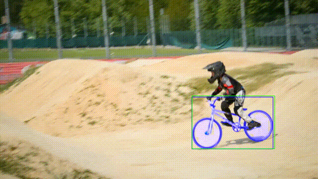

# Real Time Object Tracking Demo


## Overview  

This repository provides a comprehensive real-time object tracking demo using OpenCV-based tracking networks with webcam input. It features the implementation of six different tracking algorithms: MIL, KCF, CSRT, DaSiamRPN, NanoTrackV2, and ViT, each offering unique strengths in terms of speed, accuracy, and robustness for various tracking scenarios.

Additionally, this project integrates Samurai to evaluate the tracking accuracy on pre-recorded videos in Google Colab, allowing for in-depth performance analysis. The repository demonstrates how different tracking methods perform in real-world conditions and serves as a practical reference for real-time tracking applications in computer vision.

**Note:**
**This repository was specifically created as part of a technical interview assessment, showcasing expertise in real-time object tracking and performance evaluation techniques.**


## Output
<div align="center">
  
</div>

# **First Way: OpenCV-Based Tracking with Webcam Input**  
This approach features the implementation of six different tracking algorithms: **MIL, KCF, CSRT, DaSiamRPN, NanoTrackV2, and ViT**, each offering unique strengths in terms of speed, accuracy, and robustness for various tracking scenarios. In the next section, we will discuss the strengths and limitations of each method to provide insights into their performance.  

## **Tracking Algorithm Breakdown**  

### **1. MIL (Multiple Instance Learning Tracker)**  
- **How It Works:** MIL tracker trains an online classifier with positive and negative samples around the target object, allowing it to adapt during tracking.  
- **Strengths:** Can handle partial occlusions and some appearance variations.  
- **Limitations:** Prone to drift over time, as it may incorrectly update with false positives.  

### **2. KCF (Kernelized Correlation Filter Tracker)**  
- **How It Works:** Uses correlation filters in the frequency domain to track the object efficiently.  
- **Strengths:** Very fast and computationally efficient, suitable for real-time applications.  
- **Limitations:** Struggles with large-scale variations, occlusions, and non-rigid objects.  

### **3. CSRT (Discriminative Correlation Filter with Channel and Spatial Reliability Tracker)**  
- **How It Works:** An improved version of KCF, CSRT adjusts filter responses by considering spatial reliability maps, leading to better accuracy.  
- **Strengths:** More robust to occlusions, scale changes, and deformations compared to KCF.  
- **Limitations:** Slower than KCF, making it less ideal for high-speed tracking applications.  

### **4. DaSiamRPN (Dual-Anchor Siamese Region Proposal Network)**  
- **How It Works:** A deep learning-based Siamese network that generates region proposals and matches features between frames for accurate tracking.  
- **Strengths:** Highly accurate and robust to occlusions, scale variations, and background clutter.  
- **Limitations:** Requires a pre-trained model, and inference speed is slower compared to traditional correlation filter-based trackers.  

### **5. NanoTrackV2**  
- **How It Works:** An ultra-lightweight deep learning-based tracker optimized for efficiency and real-time performance.  
- **Strengths:** Extremely fast and efficient, making it suitable for edge devices and low-power applications.  
- **Limitations:** May sacrifice some accuracy compared to heavier deep learning models like DaSiamRPN or ViT.  

### **6. ViT (Vision Transformer-Based Tracker)**  
- **How It Works:** Utilizes a transformer-based architecture for tracking, leveraging self-attention mechanisms to model spatial relationships effectively.  
- **Strengths:** Superior accuracy and robustness, capable of handling long-term dependencies and complex transformations.  
- **Limitations:** Computationally expensive and requires a high-performance GPU for real-time tracking.  

## **Implementation Details**  

This implementation provides a **real-time object tracking framework** leveraging OpenCV's built-in tracking algorithms. The core of the system revolves around **hybrid tracking**, where a primary tracker is supplemented by a backup tracker to improve robustness and recover from failures.

### **HybridTracker Class**  
- Implements a **dual-tracker approach**, where both a main tracker and a backup tracker are initialized.  
- Every **30 frames**, the backup tracker updates and, if successful, reinitializes the main tracker to ensure accuracy.  
- This design enhances resilience against tracker drift and sudden object motion.  

### **Tracker Selection Mechanism**  
- The **GET_TRACKER()** function provides an interactive selection of one of the six available tracking algorithms (MIL, KCF, CSRT, DaSiamRPN, NanoTrackV2, ViT).  
- If **MIL or KCF** is selected, the system wraps them inside the **HybridTracker** with a CSRT backup tracker to compensate for their lower robustness.  

### **Video Processing and Performance Metrics**  
- The script captures frames from a **webcam**, allows the user to **select a region of interest (ROI)**, and then initializes the tracker.  
- A **video writer** saves the tracking output to disk for later review.  
- Performance metrics include:  
  - **Frames Per Second (FPS)**: Real-time processing speed.  
  - **Latency Measurement**: The time taken to process each frame.  

### **Output and Recording**  
- The tracking results are displayed in an **OpenCV window**, with a green bounding box drawn around the detected object.  
- A **video output file** is saved with a timestamped filename.  
- The **ESC key (27)** allows the user to exit tracking at any time.  

This approach ensures a **balanced trade-off between speed and robustness**, making it suitable for real-time applications requiring reliable object tracking. 🚀  

## **Installation and Setup**  

Follow these steps to set up and run the tracking demo:  

### **1. Clone the Repository**  
```bash
git clone <https://github.com/mohamedsamirx/Real-time-object-tracking-demo.git>
cd <Real-time-object-tracking-demo>
```


### **2. Install Dependencies**  
```bash
 pip install opencv-contrib-python
```

### **3. Run the Tracker**
Navigate to the Open-CV directory and start the tracking script:  
```bash
cd Open-CV
python3 Tracker.py
```

## **Demo**

<div align="center">
  
</div>


# **Second Way: SAMURAI-Based Single Object Tracking**

This approach utilizes **SAMURAI** (Segment Anything Model Unified and Robust AI) for single-object tracking, leveraging its advanced deep learning capabilities to achieve high accuracy and robustness. Unlike traditional OpenCV-based trackers, SAMURAI incorporates modern transformer-based architectures to enhance tracking performance, especially in complex scenarios with occlusions, fast movements, and dynamic environments.

## **Tracking Algorithm Breakdown**

### **SAMURAI Tracker**

**How It Works:**
- **Motion-Aware Memory Mechanism:** SAMURAI introduces a motion-aware memory selection mechanism that incorporates temporal motion cues to predict object motion and refine mask selection. This approach effectively addresses challenges in visual object tracking, such as managing crowded scenes with fast-moving or self-occluding objects. 
- **Zero-Shot Learning:** SAMURAI operates without the need for additional training or fine-tuning. It directly utilizes the weights from SAM 2.1 to conduct visual object tracking experiments, making it a zero-shot method. 

**Strengths:**
- **High Accuracy:** Demonstrates superior tracking results in scenes with multiple objects of similar appearances, effectively handling occlusions and fast movements. 
- **Robustness:** Capable of maintaining performance without retraining or fine-tuning, showcasing strong generalization across various scenarios.

**Limitations:**
- **Computational Complexity:** The advanced mechanisms may introduce additional computational overhead compared to traditional tracking methods.
- **Streaming Input Support:** Currently, SAMURAI does not support streaming input (e.g., webcam) directly. 

This method is particularly useful for scenarios where tracking precision is critical, such as surveillance, autonomous driving, and sports analytics.


## **Implementation and Future Plans**
To utilize SAMURAI for GPU-based tracking, I implemented and tested it in **Google Colab**, taking advantage of the available GPU acceleration to enhance performance. The current setup allows users to experiment with SAMURAI for offline tracking tasks, processing videos or images efficiently.

🚀 **Future Work:**
- Developing a **real-time version** of SAMURAI for live video tracking.
- Enhancing support for streaming input (e.g., webcam integration).
- Optimizing inference speed to reduce latency for practical applications.

🔗 **Try it out on Google Colab:** [Google Colab Notebook](https://colab.research.google.com/drive/1vw9kJt9_HJ2n2nDTuqf8gaDSmt3uFFOF?usp=sharing)

## **Demo**

<div align="center">
  
</div>


## **Future Enhancements and Advanced Tracking Ideas**  

To further improve the tracking pipeline, several advanced methods can be explored:  

1. **Point Tracking with CoTracker or LoCoTracker**  
   - Instead of tracking the entire bounding box, leverage **CoTracker** or **LoCoTracker** to track multiple key points within the object’s bounding box.  
   - Dynamically update the bounding box based on the motion of these tracked points, improving robustness in cases of partial occlusions, deformations, and fast movements.  

2. **SiamRPN++ and Advanced Deep Learning-Based Trackers**  
   - Integrate **SiamRPN++**, a state-of-the-art region proposal network-based tracker that combines the efficiency of Siamese networks with region-based attention for precise object localization.  
   - Explore **Transformer-based tracking models** for better long-term tracking and adaptability in complex scenes.  

3. **YOLO with DeepSORT or Feature-Based Multiple Object Tracking**  
   - Utilize **YOLO** for object detection combined with **DeepSORT** or other multiple-object tracking (MOT) algorithms.  
   - Implement **feature matching techniques** (e.g., re-identification embeddings) to track a single object persistently across frames in real-time.  
   - This approach enhances tracking robustness, especially when objects reappear after occlusions or disappear momentarily.  

By incorporating these techniques, the tracking system can achieve greater accuracy, robustness, and real-time performance, making it suitable for various real-world applications.  

### **License**  
This project is licensed under the **MIT License**. See the [LICENSE](LICENSE) file for details.  
